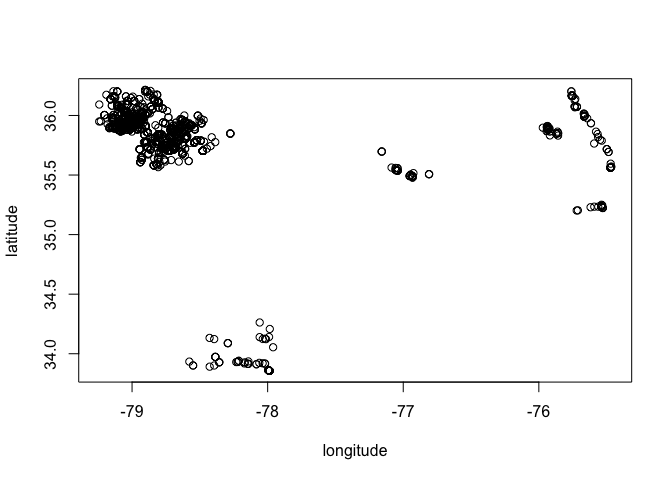

eBird Abundance Data
================
Peter Hoff
01 August, 2020

### Summary

The file `eBirdAPI.r` provides a few R functions to download and wrangle
data from the [eBird
project](https://ebird.org/science/download-ebird-data-products), using
their API. The functions include the following:

  - `eBirdGetURL`: Download generic data and leave it in json/list
    format
  - `eBirdGetData` : Download *complete* checklists from a given region
    on a given date. Returns a list that includes
      - `obsData`: numeric matrix of bird counts by checklist and
        species;
      - `metaData`: dataframe of checklist metadata.
  - `eBirdMergeData`: Merge two lists that have the format returned by
    `eBirdGetData`;
  - `eBirdNames` : Not a function, but a table that matches the bird
    codes used by eBird to common names.

### Comments:

1)  To download data from eBird you need to have an eBird API key, and
    set it as an environment variable with `Sys.setenv(EBIRD_KEY =
    "xxxxxxxx")`.  
2)  There are some duplicates (friends who collect and report the same
    data). This should be fixed in the future.
3)  Some birders just report presence without a numeric count. For these
    cases, numeric counts are imputed, but all imputed values end in
    `.5` so that they can be identified.
4)  The eBird API only allows 200 checklists to be downloaded per
    request. If this limit is reached then only the first 200 lists are
    included in the dataset, and a warning message is printed.  
5)  There exist a couple of R packages for accessing eBird data:
    [rebird](https://github.com/ropensci/rebird) and
    [auk](https://github.com/CornellLabofOrnithology/auk/). The latter
    assumes you have already downloaded a super-large eBird database.
    The former uses the API (like the code in this repo), but doesn’t
    seem to provide access to information on checklist completeness
    (which is important to know for statistical analysis).

### How to use

Load in the functions and see what they are:

``` r
source("https://raw.githubusercontent.com/pdhoff/eBird-Abundance-Data/master/eBirdAPI.r")

#source("eBirdAPI.r")

objects()
```

    ##  [1] "counties"       "dates"          "eBdat"          "eBirdGetData"  
    ##  [5] "eBirdGetURL"    "eBirdMergeData" "eBirdNames"     "i"             
    ##  [9] "j"              "obsPH"

Download and merge one week of data from two NC counties (Durham and
Beaufort):

``` r
counties<-c("US-NC-063","US-NC-013")
dates<-as.Date(0:6,origin = "2020-05-01")

eBdat<-NULL
for(i in seq_along(counties)){
  for(j in seq_along(dates)){
    eBdat<-eBirdMergeData(eBdat,eBirdGetData(region=counties[i],date=dates[j]))
    cat(counties[i],dates[j],"\n")
}}
```

    ## US-NC-063 18383 
    ## US-NC-063 18384 
    ## US-NC-063 18385 
    ## US-NC-063 18386 
    ## US-NC-063 18387 
    ## US-NC-063 18388 
    ## US-NC-063 18389 
    ## US-NC-013 18383 
    ## US-NC-013 18384 
    ## US-NC-013 18385 
    ## US-NC-013 18386 
    ## US-NC-013 18387 
    ## US-NC-013 18388 
    ## US-NC-013 18389

Examine metaData a bit:

``` r
eBdat$metaData[1:3,]
```

    ##          id             date duration latitude longitude loc1  loc2      loc3
    ## 1 S68271265 2020-05-01 19:30    0.083 35.90281 -79.00055   US US-NC US-NC-063
    ## 2 S68215893 2020-05-01 18:49    0.650 35.92115 -78.94957   US US-NC US-NC-063
    ## 3 S68209974 2020-05-01 17:27    0.600 36.00304 -78.94707   US US-NC US-NC-063

``` r
plot(eBdat$metaData$long,eBdat$metaData$lat,xlab="longitude",ylab="longitude") 
```

<!-- -->

Examine obsData a bit:

``` r
eBdat$obsData[1:3,1:6] 
```

    ##           Acadian Flycatcher American Bittern American Coot American Crow
    ## S68271265                  0                0             0             0
    ## S68215893                  0                0             0             1
    ## S68209974                  0                0             0             1
    ##           American Goldfinch American Kestrel
    ## S68271265                  0                0
    ## S68215893                  1                0
    ## S68209974                  0                0

``` r
## Obtain counts per hour of effort 
obsPH<-sweep(eBdat$obsData,1,eBdat$metaData$duration,"/") 

## Top 20 birds in Durham
sort(apply(obsPH[eBdat$metaData$loc3==counties[1],],2,mean),decreasing=TRUE)[1:20]  
```

    ##      Northern Cardinal          Carolina Wren  Blue-gray Gnatcatcher 
    ##              4.5389025              2.5163281              1.9679265 
    ##        Tufted Titmouse           Canada Goose     Carolina Chickadee 
    ##              1.6685351              1.6183317              1.5482120 
    ##         American Robin       Great Blue Heron          Cedar Waxwing 
    ##              1.4991179              1.4985549              1.4363564 
    ##          House Sparrow         Red-eyed Vireo         Common Grackle 
    ##              1.2909832              1.2822578              1.2762000 
    ##           Gray Catbird         Indigo Bunting       Eastern Bluebird 
    ##              1.2167326              1.1752927              1.1272574 
    ##          Mourning Dove         Eastern Towhee Red-bellied Woodpecker 
    ##              1.0101769              0.9957333              0.9868141 
    ##            House Finch     American Goldfinch 
    ##              0.9864079              0.9840758

``` r
## Top 20 birds in Beaufort 
sort(apply(obsPH[eBdat$metaData$loc3==counties[2],],2,mean),decreasing=TRUE)[1:20]  
```

    ##             Canada Goose        European Starling            Laughing Gull 
    ##                10.080908                 5.913111                 5.299309 
    ##        Northern Cardinal           Common Grackle                 gull sp. 
    ##                 4.790157                 4.569693                 3.901678 
    ##            Purple Martin                  Mallard Great Crested Flycatcher 
    ##                 3.341003                 3.215959                 2.683719 
    ##       Carolina Chickadee            Mourning Dove            Carolina Wren 
    ##                 2.428280                 2.303843                 2.299002 
    ##           American Robin            Chimney Swift            Cedar Waxwing 
    ##                 1.931231                 1.886298                 1.824725 
    ##             Barn Swallow          Tufted Titmouse     Red-winged Blackbird 
    ##                 1.765430                 1.631140                 1.422485 
    ##                 Blue Jay Double-crested Cormorant 
    ##                 1.421758                 1.321752
